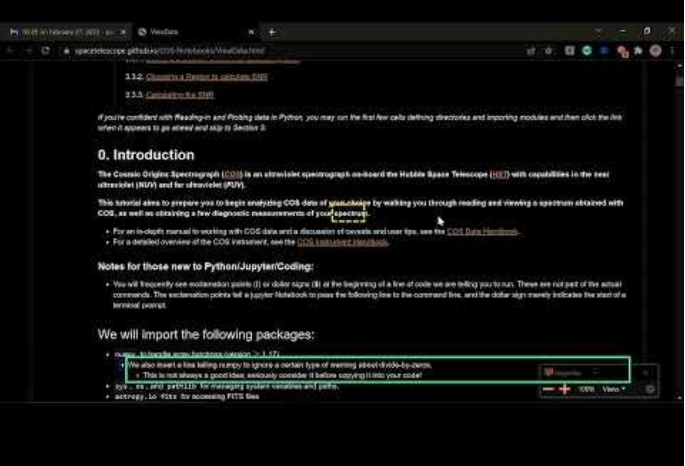

# Astronomy Notebooks for All

**PI:** Jennifer Kotler 

**Co-I’s:** Erik Tollerud, Isabela Presedo-Floyd (Quansight Labs), 
Tony Fast (Quansight Labs), Patrick Smyth (Iota School) 

**Budget:** $86,115 | **With internal costs:** $102,531

## Abstract

This proposal will enable scientists who rely on assistive technology (ie: screen readers) to use Jupyter Notebooks, and for STScI to engage this community through educational events. We will accomplish these objectives through four activities: usability testing, implementing accessibility enhancements, contributing to the open software ecosystem, and education.

## Justification

STScI builds many community resources using Jupyter notebooks: some pages are “notebook first” like the [JWST Data Analysis Notebooks](https://spacetelescope.github.io/jdat_notebooks/), [MAST’s notebooks](https://spacetelescope.github.io/notebooks/), or the [COS tutorials](https://github.com/spacetelescope/notebooks/tree/master/notebooks/COS), others are attached to other efforts like the [POPPY demo notebooks](https://github.com/spacetelescope/poppy/tree/develop/notebooks), the [JWebbinar notebooks](https://jwebbinar.science.stsci.edu/), or the [WFC3 tools](https://wfc3tools.readthedocs.io/en/stable/wfc3tools/wf3cte.html). Additionally, STScI science staff use notebooks for critical aspects of their research. Thus, Project Jupyter plays a central role in modern data science workflows. Despite this importance, these notebooks are inaccessible to people with disabilities, especially those who rely on assistive technology. Impacted users must find extreme workarounds or [give up using them entirely](https://www.freelists.org/post/program-l/Accessability-of-Jupyter-notebooks). Students with disabilities have [reported leaving their field](https://github.com/jupyterlab/jupyterlab/issues/9399#issuecomment-740524422) once they learn their chosen career’s foundational tools are inaccessible to them. STScI contributes to this problem by producing extensive inaccessible resources and infrastructure in Jupyter. The Institute has committed to fostering an inclusive environment; as a government contractor our work must comply with standards of accessibility laid out in legislation such as the Americans with Disabilities Act (ADA). This problem must be solved!

Notebooks have had this issue for many years, but as an open-source community driven project, Project Jupyter has not made meaningful progress towards solving it. Resolving accessibility barriers is not a simple task that can be ticketed and fixed by the community alone. A user-centered approach with iterative usability testing and development is needed to make notebooks accessible. This is where STScI can play a vital role, leveraging our expertise gained from previous work on [sonification](https://astronify.readthedocs.io/) and accessibility. 

*Please watch this video recorded by Smyth for a more detailed explanation of notebook accessibility when rendered in the browser: [Accessibility Analysis of Jupyter Notebook HTML Output](https://www.youtube.com/watch?v=KsUF_HjA97U)*

By following this user-centered approach and by liaising with Project Jupyter to contribute improvements, STScI will demonstrate leadership through a timely, high-impact contribution to open source software in line with our core values of inclusion, open research, and legacy: making tools accessible for the next generation of astronomers. Contributing this work to Project Jupyter will reduce any need for the Institute to continue maintaining the notebook rendering mechanism. Upstreamed improvements will benefit both STScI users and the community of almost one million data scientists and researchers who render notebooks to share their research. Running educational events that teach accessibility concepts to technical, research, and administrative stakeholders at STScI will help to crystallize and share insights developed during the project and pave the way for future initiatives related to inclusion at the Institute. 

## Project Scope

To improve accessibility of notebooks rendered in STScI notebook repositories, we will focus on four activities: usability testing, implementation of accessibility enhancements, education, and community contribution. These stages may not happen in order and will inform each other.

### Usability Testing
Many accessibility initiatives put standards before the feedback of people with disabilities, resulting in surface-level improvements that do not create more inclusive communities or accessible tools. We will follow an inclusive and participatory approach focusing on learning impacted users’ preferred experience in resolving accessibility issues. The usability tests will broadly focus on common tasks for working with rendered notebooks, such as navigating through many layers of content and ensuring appropriate assistive settings are available. 

We will recruit impacted users to participate in the usability tests. Testers will be paid for their time at an industry-standard rate. Further input may be provided asynchronously by community members writing to us about their experience. While not our primary source of feedback, we aim to share developments on a public GitHub repository, opening the project to a broader pool of contributors from open-source, accessibility, and STEM communities. We intend to extend this spirit of inclusion to our workshops, reserving space for members of affected communities.

Usability experts Kotler and Presedo-Floyd will facilitate the sessions remotely through Zoom (used for accessible testing in the [Astronify](https://astronify.readthedocs.io/)  DDRF). If accessibility testers live within easy travel of a team member and current public health guidelines allow, some sessions may be scheduled in-person. Tests will be recorded so they can be reviewed later internally. A technical team member will attend each session to troubleshoot problems that interfere with testing. If an issue is straightforward to address, they may make small fixes in real time to iterate on the solution with the tester. Larger issues will be recorded as a ticket and addressed later. We will meet with testers again between development iterations to incorporate further feedback.

### Implementing accessibility enhancements

We will focus on implementing an accessible notebook template, the precursor to how notebooks are rendered in browsers. This provides a high value-to-effort ratio because very few templates are automatically applied to large numbers of notebooks at both STScI and in the wider scientific community. We will test our templates with a notebook that combines the Jupyter team [benchmark notebooks](https://github.com/jupyterlab/benchmarks), and a straightforward science case from STScI’s public notebook collection (either [JDAT notebooks](https://spacetelescope.github.io/jdat_notebooks/) or the [general notebooks](https://spacetelescope.github.io/notebooks/). This testing notebook will be run through the Jupyter’s [nbconvert](https://github.com/jupyter/nbconvert) machinery (the backend used for STScI’s notebook repositories and the public [nbviewer](https://nbviewer.org/) website) to produce static web pages of these notebooks. To ensure testing covers the needs of our scientists, the test notebook will have the variety of cell types (image, text, code, etc.), outputs, and interactive widgets found in ST notebooks. We will conduct development and usability testing as follows:

1. We will conduct an initial usability test to identify the most severe accessibility issues, informing initial development work.
2. We will follow with two more cycles of iterative testing of updated notebooks to better identify user-desired behavior. These cycles of feedback and development will result in an accessible notebook template that emphasizes an enjoyable accessibility experience.

### Contributing to the Open Software Ecosystem 

Once we create an accessible rendered notebook template for STScI projects, we will share it with the wider Jupyter project targeting nbviewer and nbconvert ensuring that all future notebooks are rendered accessible by default. By merging this template in nbconvert this work will be maintained by the Jupyter community—**no further STScI maintenance required**. We will also produce a report summarizing the findings from the usability research describing the accessibility enhancements for rendered notebooks. This document will provide a valuable foundation for future revisions to the schema so that all notebooks, not only those rendered in HTML, will be more accessible in the future.

### Education - Accessibility Events

By developing an awareness of accessibility issues, STScI researchers, administrators, and technologists can become leaders in the creation of inclusive technical infrastructure and resources. We propose having Smyth of Iota School host two hybrid, educational training days to develop an understanding of inclusive practices related to accessibility at STScI:

1. **STScI Day of Accessibility:** This full-day educational event will combine engaging activities teaching accessibility skills and talks by STEM researchers with disabilities.
2. **A11Y Hackathon:** In this full-day accessibility hackathon, participants will contribute to public resources and documentation created by STScI by adding alt text to images, transcribing recordings, and checking documents for common accessibility issues.

## Work Plan

Our team is well suited to achieve the goals of our proposal. We are subject matter experts in usability testing, development, Jupyter, screen readers, and accessibility. A vital part of this proposal is the inclusion of Patrick Smyth, Chief Learner at Iota School. Patrick is a blind developer and research computing specialist with ties to blind and visually impaired coding communities. Iota School offers inclusive technical and accessibility training to research organizations. Patrick will provide expertise in development, user testing, and educational events. Kotler has run usability tests with blind programmers and designed accessible software through her work on [Astronify](https://astronify.readthedocs.io/en/latest/) and MAST. Fast and Presedo-Floyd of Quansight are entrenched Jupyter community members with cross-project knowledge and connections to other major contributors. They have spent over a year focused on accessibility within Jupyter, from community outreach work to direct contributions. Their community knowledge will enable us to use momentum from existing Jupyter accessibility efforts towards the success of this proposal.

| Time Period | Activity |
|---|---|
| May-June 2022 | Write usability testing script, Recruit testers |
| July-August 2022 | Run first round of tests, Host STScI Day of Accessibility in person |
| August & September ‘22 | Design and implement notebook adjustments |
| October-December ‘22 | Run more tests as needed, Host A11Y Hackathon |
| December ‘22 & January ‘23 | Design and implement more notebook adjustments |
| February-March ‘23 | Finalize a template with our accessibility updates |
| April ‘23 | Update the ST notebooks & internal machinery, Propose adding the accessible templates upstream to nbconvert to improve research accessibility in the broader scientific community |

## Final Outcomes - Deliverables & Program Impact 

This grant would culminate in four major deliverables: 

1. **An accessible notebook template** that improves the experience of notebooks rendered in the browser, especially for people who use assistive tech. The STScI community and far beyond will be impacted—millions of notebooks are accessed through browsers monthly.
2. **An accessible benchmark notebook** that can be used to test future ST software utilizing notebooks for accessibility
3. **A report of our usability testing findings.** These lessons learned will be a helpful reference for other Jupyter projects on how to make the notebook file, interfaces, or other projects accessible. In particular, this document will assess the feasibility of accessibility work on the Jupyter notebook editor, which may serve as a basis for future high impact accessibility work funded through inter-organizational grant initiatives.
4. **Two accessibility education events** to raise awareness of accessibility in STEM

## Previous DDRF Awards

**Kotler -** Create with Light - High School Artist Grant, PI (completed 2022)

**Tollerud -** Community Software Initiative, science PI (completed 2020)
